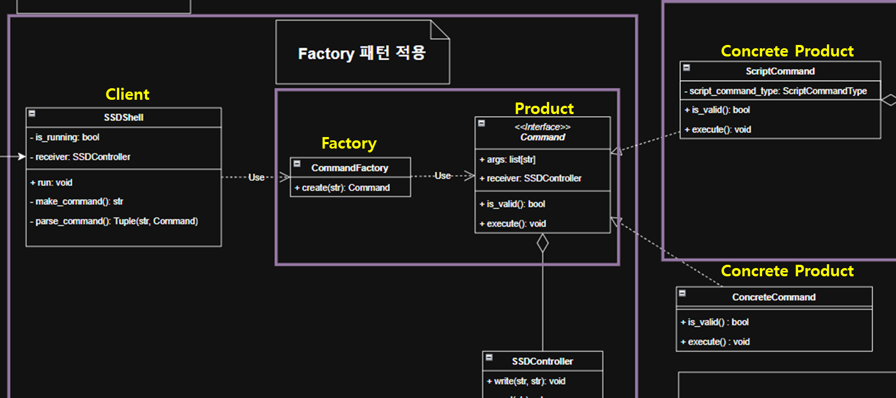
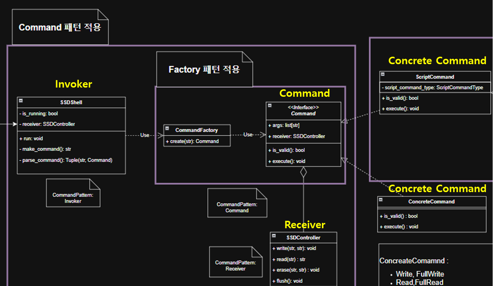
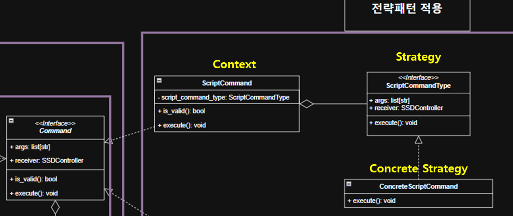

# SSD 프로젝트 - Team B

이 프로젝트는 SSD(Solid State Drive)의 내부 동작을 시뮬레이션하여 `쓰기`, `읽기`, `삭제` 등 주요 동작을 이해하고 실험할 수 있도록 설계되었습니다.\
명령어 버퍼링, 최적화 전략, 셸 인터페이스 등이 포함되어 있습니다.

📁 언어: Python\
🧪 테스트: Pytest

---

## ✨ 주요 기능

- 명령어 기반 SSD 시뮬레이션 (`write`, `read`, `erase`, `flush`, `exit`)
- 명령어 버퍼와 최적화 기능 (Ignore & Merge 전략)
- 디자인 패턴 적용: **Command**, **Factory**, **Strategy**
- 사용자 셸 인터페이스 (`ssd_shell.py`)
- 모듈화 및 테스트 가능 구조

---

## 🚀 시작하기

### 1. 저장소 클론

```bash
git clone https://github.com/KKimC/SSD_project_Team_B.git
cd SSD_project_Team_B
```

### 2. PYTHONPATH 설정

모듈을 정상적으로 임포트하기 위해 PYTHONPATH를 설정합니다:

```bash
# Windows (cmd)
set PYTHONPATH=src

# macOS/Linux (bash/zsh)
export PYTHONPATH=src
```

### 3. SSD 셸 실행

```bash
python src/ssd_shell.py
```

### 4. 사용 가능한 명령어 (셸 내)

```shell
> write 0 dataA
> write 1 dataB
> erase 0
> read 0
> flush
> exit
```

---

## 🗂️ 프로젝트 구조
- logs: logger 출력, 동작 시 파일 생성
- outputs: SSD 출력, 동작 시 파일 생성
- src: shell, SSD 구현
- src/utils: common functions 구현
- src/buffer: Command buffer, 동작 시 파일 생성
- tests: test cases 구현

```
SSD_project_Team_B/
│  .gitignore
│  pytest.ini
│  README.md
│  requirements.txt
│
├─.github
│      pull_request_template.md
│
├─logs/                # 로그 출력 디렉토리 (실행 시 생성)
├─outputs/             # SSD 출력 파일 저장 디렉토리 (실행 시 생성)
│
├─src/
│  │  command.py
│  │  command_factory.py
│  │  command_script.py
│  │  constants.py
│  │  custom_exception.py
│  │  logger.py
│  │  ssd.py
│  │  ssd_controller.py
│  │  ssd_file_manager.py
│  │  ssd_shell.py
│  │
│  ├─buffer/           # 명령어 버퍼 구현
│  └─utils/            # 헬퍼 함수 및 유효성 검사
│     │  helpers.py
│     │  validators.py
│
└─tests/
    │  test_cmd_three.py
    │  test_shell.py
    │  test_shell_erase.py
    │  test_ssd.py
```

---

## 💾 SSD 클래스 구조 및 기능 요약

### ✅ `SSD` 클래스

- 실제 LBA 공간을 시뮬레이션하는 클래스
- 주요 기능:
  - `read(lba)`: 읽기
  - `write(lba, value)`: 쓰기
  - `erase(address, size)`: 블록 단위 삭제
  - `flush()`: 버퍼에 있는 명령어를 실제 저장소에 적용
  - `optimization()`: 5개 명령어 버퍼 최적화 (Ignore/Merge 전략 적용)
- 유효성 검사 및 명령어 버퍼 관리 기능 포함

### ✅ `Optimizer` 클래스

- 버퍼 내 명령어 정렬 및 최적화 처리
- 명령어를 `fast_read` 시뮬레이션하여 낭비된 erase/write 방지
- 최적화 알고리즘:
  - **Ignore**: 덮어쓰기 되는 명령어 제거
  - **Merge**: 인접한 erase 명령어 병합

### ✅ `Flush` 클래스

- 버퍼의 명령어를 실제 NAND에 적용하는 클래스
- `flush_write()` 및 `flush_erase()` 내부적으로 사용됨

### ✅ `CommandInvoker` 클래스

- 커맨드라인 인자를 받아 적절한 SSD API를 호출하는 실행기 역할

### 📂 버퍼 구조

- 최대 5개의 명령어를 `buffer/` 디렉토리에 저장
- 명령어는 `번호_명령_주소_값` 형태 (`1_W_2_0xABCDEF01`)
- 5개가 되면 자동으로 flush 및 최적화 수행
- `empty` 명령어는 남은 슬롯을 채우기 위한 자리표시자

---

## 🖥️ SSD 셸 인터페이스 (Shell Interface)

`src/ssd_shell.py`는 SSD 시뮬레이터와 상호작용할 수 있는 셸 환경을 제공합니다.

### 🔹 사용 방식

- **인터랙티브 모드** (직접 입력)

```bash
python src/ssd_shell.py
```

```text
Shell> write 0 0xAABBCCDD
Shell> read 0
Shell> erase 0 2
Shell> flush
Shell> exit
```

- **스크립트 모드** (사전 정의된 명령어 실행)

```bash
python src/ssd_shell.py shell_scripts.txt
```

`shell_scripts.txt` 예시:

```
write 0 0xAABBCCDD
write 1 0xDEADBEEF
flush
read 0
exit
```

### 🔹 클래스 요약

#### `SSDShell`

- 사용자 입력을 받아 명령어 객체로 파싱하고 실행
- 잘못된 명령어는 무시 또는 에러 메시지 출력
- `exit` 명령어 시 프로그램 종료

#### `SSDRunner`

- 텍스트 파일(`shell_scripts.txt`)의 명령어를 순차적으로 실행
- 테스트 자동화, 시나리오 검증 등에 활용 가능

---

## 🧪 테스트 실행 방법

Pytest를 사용하여 단위 테스트를 실행할 수 있습니다:

```bash
pytest tests/
```

---

## 🧠 디자인 패턴

### 🏭 Factory 패턴

- 셸 명령어 객체 생성을 `command_factory`에 위임하여, 명령어 유형 추가 시 유연하게 대처할 수 있습니다.



---

### 📋 Command 패턴

- 명령 실행 로직을 `Command` 객체와 `Receiver`(예: SSD)에 위임하여 실행 책임을 분리하고 확장성을 확보합니다.



---

### 🧩 Strategy 패턴

- 다양한 테스트 스크립트를 전략 객체로 처리하여 셸 로직의 일관성과 테스트 확장성을 제공합니다.



